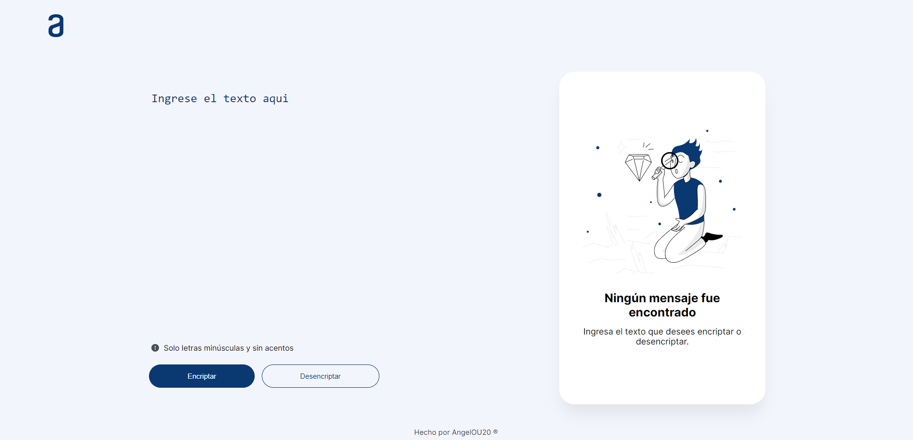

# Challenge Encriptador | Oracle + Alura
Construyendo un encriptador de texto con Javascript

## Aprendiendo
Este proyecto es un encriptador de texto construido utilizando HTML, CSS y JavaScript.

    
    
    

## Descripción
El objetivo de este proyecto es crear una aplicación web que permita encriptar y desencriptar texto de manera sencilla y segura.

## 🔒 Diccionario de encriptacion

| 🔑 Llave | ✏️ Reemplazo |
|-----------|-----------|
| e | enter |
| i | imes |
| a | ai |
| o | ober |
| u | ufat |

## Cómo utilizar el encriptador de texto

- Ingresa el texto que deseas encriptar en el campo de texto.
- Haz clic en el botón "Encriptar" para cifrar el texto.
- El texto encriptado se mostrará en el área de salida.
- Para desencriptar el texto, haz clic en el botón "Desencriptar".
- El texto original se mostrará en el área de salida.
- Puedes copiar el texto encriptado o desencriptado haciendo clic en el botón "Copiar".

## Captura de pantalla

